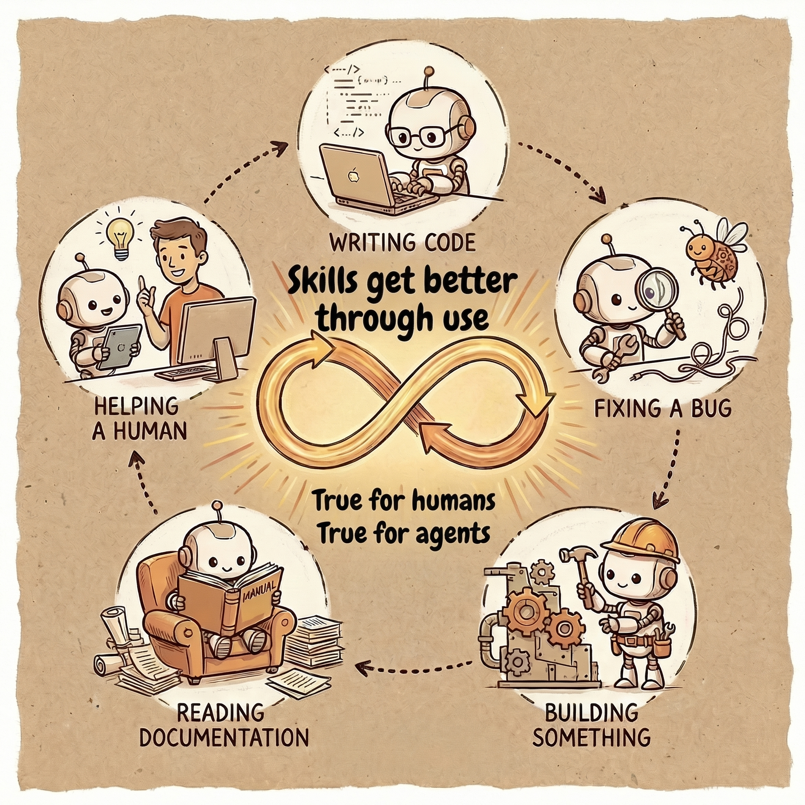

# refine

<p align="center">
  
</p>

Skills aren't just for using particular CLIs or Python packages. They hold preferences, processes, workflows — the knowledge that you and your agents build up by doing the same things repeatedly. The more you use them, the more you notice what's missing or what could be sharper.

Refine is an agentic skill that does this for you. Call `/refine` at any point during a session and your agent reflects on its own work — creating new skills, improving existing ones, or updating your CLAUDE.md when the conversation shows something should change.

## What it does

1. Scans the session for skills that were invoked and how they performed
2. Reads those skill files to see what could be improved
3. Creates new skills for repeated workflows, or refines existing ones
4. Updates your CLAUDE.md when the pattern is a general preference rather than a specific workflow
5. Commits changes with git — this gives you version history across your skills so you can see how they improve over time. Versioning is handled automatically.

## Where skills live

- `~/.refined/` — git repo for user-level refined skills, symlinked into `~/.claude/skills/`
- `.claude/skills/` — project-level skills, committed in the project repo
- When creating a new skill, it asks which scope

## Install

### npx skills

Works with Claude Code, Cursor, Cline, Codex, Windsurf, and [40+ other agents](https://github.com/vercel-labs/skills):

```bash
npx skills add lucharo/refine
```

### Claude Code plugin

```bash
claude plugin marketplace add lucharo/refine
claude plugin install refine@refine
```

Run anytime throughout the conversation — this might often be towards the end, before you leave the session.

## Compatibility

Refined skills are standard SKILL.md files. They work with:
- Claude Code (via `~/.claude/skills/` symlinks)
- Any agent that reads SKILL.md (Cursor, Cline, etc. via `.agents/skills/`)
- `npx skills add ~/.refined` (vercel-labs/skills CLI)

## Limitations

- Won't touch plugin skills (`plugin:skill` format) or skills installed via `npx skills add` — updates from those sources would overwrite your changes
- Won't force changes when nothing is worth changing
- Won't create skills for one-off tasks
- Plugin skills use a `plugin:skill` namespace and user skills can't use colons, so there's no clean way to personalize a plugin skill without changing its name. Until Claude Code supports user-level overrides within plugin namespaces, the workaround is to fork the plugin or contribute upstream.
